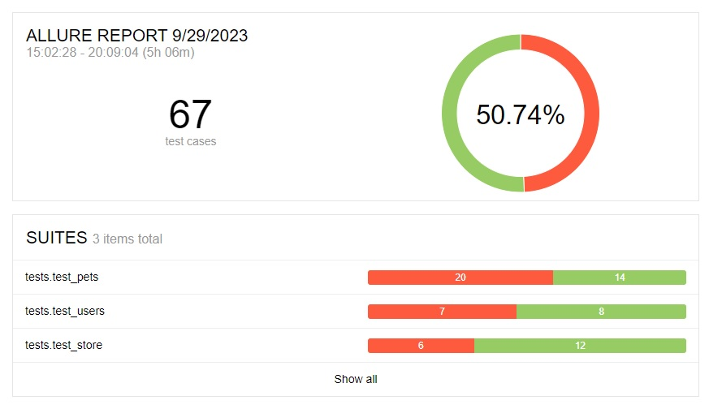

# Petstore swagger auto tests
This is a project aimed at test coverage for the [petstore swagger](https://petstore.swagger.io/). It includes a test plan, a checklist, a list of identified defects, suggestions for project improvement, and automated tests using the Python, Pytest, Requests, Allure with logger.<br>
Some of the planned tests couldn't be implemented because certain defects were found.
### 1. [Test plan](https://github.com/spacecowboy971809/petstore-swagger/blob/master/Docs/Test%20plan.md)
### 2. [Checklist](https://github.com/spacecowboy971809/petstore-swagger/blob/master/Docs/Checklist.md)
### 3. [Bug reports](https://github.com/spacecowboy971809/petstore-swagger/blob/master/Docs/Bug%20reports.md)
### 4. [Suggestions](https://github.com/spacecowboy971809/petstore-swagger/blob/master/Docs/Suggestions.md)

## Allure report:

This report includes passed tests, tests with errors, and incorrect tests that couldn't pass. Each test includes Description, Parameters, Execution, and an error description.


## Logger example:
_____
**Test**: tests/test_pets/test_add_pet.py::test_add_pet[payload0-75309586-a480-43a8-a656-8228fab29bac] (call)<br>
**Time**: 2023-09-28 16:22:29.313943<br>
**Request method**: POST<br>
**Request URL**: https://petstore.swagger.io/v2/pet <br>
**Request data**: {'id': 5244223214, 'category': {'id': 2, 'name': 'cats'}, 'name': 'test_cat', 'photoUrls': ['https://creapills.com/wp-content/uploads/2022/03/40-photos-animaux-hybrides-reddit-35-1.jpg', 'https://t1.gstatic.com/licensed-image?q=tbn:ANd9GcRRv9ICxXjK-LVFv-lKRId6gB45BFoNCLsZ4dk7bZpYGblPLPG-9aYss0Z0wt2PmWDb'], 'tags': [{'id': 0, 'name': 'cats_pending'}], 'status': 'pending'}<br>
**Request headers**: {}<br>
**Request cookies**: {}<br>
**Request files**: None<br>

**Response code**: 200<br>
**Response text**: {"id":5244223214,"category":{"id":2,"name":"cats"},"name":"test_cat","photoUrls":['https://creapills.com/wp-content/uploads/2022/03/40-photos-animaux-hybrides-reddit-35-1.jpg','https://t1.gstatic.com/licensed-image?q=tbn:ANd9GcRRv9ICxXjK-LVFv-lKRId6gB45BFoNCLsZ4dk7bZpYGblPLPG-9aYss0Z0wt2PmWDb' ],"tags":[{"id":0,"name":"cats_pending"}],"status":'pending'} <br>
**Response headers**: {'Date': 'Thu, 28 Sep 2023 10:22:29 GMT', 'Content-Type': 'application/json', 'Transfer-Encoding': 'chunked', 'Connection': 'keep-alive', 'Access-Control-Allow-Origin': '*', 'Access-Control-Allow-Methods': 'GET, POST, DELETE, PUT', 'Access-Control-Allow-Headers': 'Content-Type, api_key, Authorization', 'Server': 'Jetty(9.2.9.v20150224)'}<br>
**Response cookies**: {}<br>
____

## How to use:
To generate a report on local machine, you need to execute the following command in the command line at the project's root:
````
python -m pytest -s --alluredir=test_results tests/ | allure serve test_results
````
To observe the test execution process in the terminal, you can execute the following two commands sequentially:
````
python -m pytest -s --alluredir=test_results tests/
 
allure serve test_results
````
These tests can be integrated into CI/CD or used with Docker. They are flexible and can be extended in case of functionality expansion.